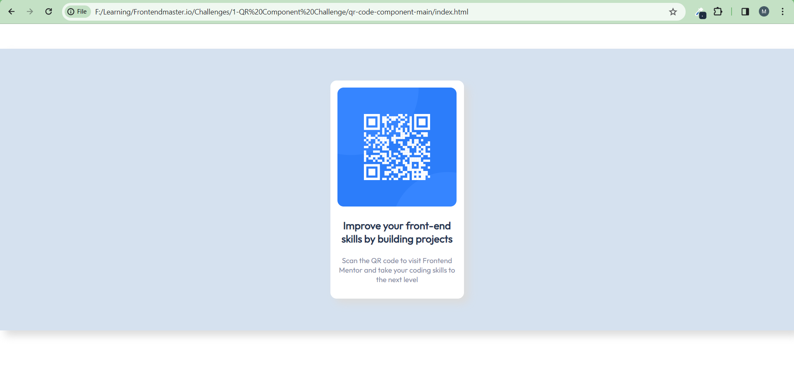

# Frontend Mentor - QR code component solution

This is a solution to the [QR code component challenge on Frontend Mentor](https://www.frontendmentor.io/challenges/qr-code-component-iux_sIO_H). Frontend Mentor challenges help you improve your coding skills by building realistic projects.

## Table of contents

- [Overview](#overview)
  - [Screenshot](#screenshot)
  - [Links](#links)
- [My process](#my-process)
  - [Built with](#built-with)
  - [What I learned](#what-i-learned)
  - [Continued development](#continued-development)
  - [Useful resources](#useful-resources)
- [Author](#author)
- [Acknowledgments](#acknowledgments)

## Overview

👨‍💻 I'm excited to share my latest project - a QR Code Component I built from scratch using HTML and CSS. This project challenged me to enhance my UI development skills, and I'm thrilled with the result. You can check it out it's live on GitHub Pages [Here](https://er-faran.github.io/frontendmaster.io-challenge/QR-CODE-COMPONENT/).

### Screenshot

### Links

- Solution URL: [Code]([https://your-solution-url.com](https://github.com/er-faran/frontendmaster.io-challenge/tree/main/QR-CODE-COMPONENT))
- Live Site URL: [Here](https://er-faran.github.io/frontendmaster.io-challenge/QR-CODE-COMPONENT/)

## My process

### Built with

- Semantic HTML5 markup
- CSS custom properties
- Flexbox
- Mobile-first workflow

### What I learned

- Deeper understanding of HTML and CSS
- Responsive design principles
- Deployment with GitHub Pages

### Continued development

- Ensuring responsiveness for a wide range of devices and screen sizes.
- Fine-tuning the CSS for the desired visual design.
- Overcoming these challenges involved online research, trial and error, and problem-solving.

### Useful resources

- The project is deployed on GitHub Pages for easy access.
- You can explore it with below useful links
 - Solution URL: [Code]([https://your-solution-url.com](https://github.com/er-faran/frontendmaster.io-challenge/tree/main/QR-CODE-COMPONENT))
 - Live Site URL: [Here](https://er-faran.github.io/frontendmaster.io-challenge/QR-CODE-COMPONENT/)

## Author

- LinkedIn: [My LinkedIn Profile](https://www.linkedin.com/in/mohammed-faran/)
- GitHub: [My GitHub Profile](https://github.com/er-faran/)
- Frontend Mentor - [My Frontent Mentor Profile](https://www.frontendmentor.io/profile/er-faran)

## Acknowledgments
- Special thanks to [frontendmentor.io] for giving challenge.
